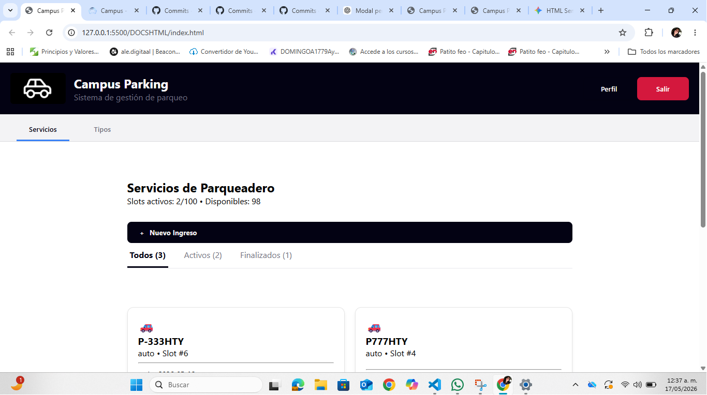
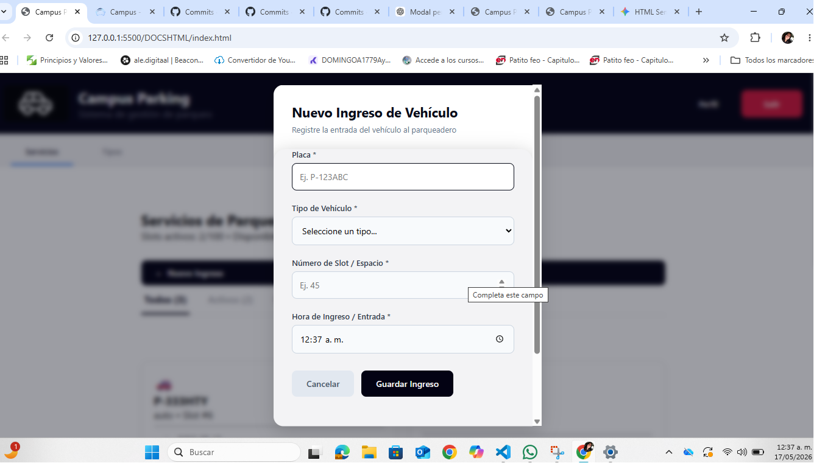
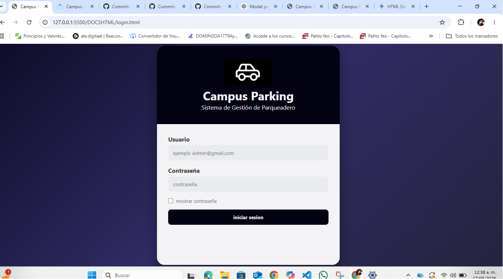

# 🚗 Campus Parking — Sistema de Gestión de Parqueadero

**Campus Parking** es una solución web diseñada para automatizar el control operativo de un parqueadero. El sistema permite gestionar los flujos de entrada y salida de vehículos en tiempo real, calcular tarifas dinámicas basadas en el tiempo de permanencia y administrar tanto las categorías de vehículos como los datos del perfil del administrador.

Este proyecto fue planificado visualmente en **Figma**, organizado por sprints en **Notion** como cerebro digital, y desarrollado aplicando principios de código limpio y arquitectura modular.






---

## 💻 Información de la Autora y Propósito

* **Autora:** Evelyn Noemi Barrios Mendez
* **Rol:** Desarrolladora Full Stack en Formación (Campusland)
* **Propósito de la Aplicación:** Resolver la saturación y la falta de control en los registros de parqueos mediante un sistema digital centralizado que automatice los cálculos de cobro, elimine los errores manuales de tiempo y permita una administración paramétrica de tarifas.

---

## 🛠️ Tecnologías y Herramientas Utilizadas

* **HTML5:** Estructuración semántica de la interfaz y uso de elementos nativos `<dialog>` para el despliegue de ventanas emergentes sin dependencias externas.
* **CSS3:** Maquetación moderna utilizando variables globales y un sistema de cascada controlado. Los estilos están divididos en microcomponentes para evitar colisiones visuales.
* **JavaScript (ES6):** Motor lógico de la aplicación encargado de la manipulación del DOM, control del tiempo, cálculos matemáticos y persistencia de datos.
* **Figma:** Utilizado para la conceptualización visual, diseño de interfaces (UI) y prototipado antes de la fase de maquetación.
* **Notion:** Centro de organización personal, gestión de tareas diarias y documentación del flujo de desarrollo.

# ⚙️ Funcionalidades Implementadas en JavaScript
La lógica de la aplicación se construyó utilizando JavaScript puro para controlar las siguientes características del sistema:

Persistencia de Datos (localStorage): El estado de la aplicación no se pierde al recargar la página. Toda la información de los vehículos activos, el historial de servicios, las tarifas y las credenciales de usuario se leen y escriben en la memoria local del navegador.

Manejo Dinámico del DOM y Eventos: Control absoluto del ciclo de vida de los modales nativos (.showModal() y .close()), escucha de formularios para evitar recargas asíncronas y conmutación de pestañas para intercambiar las vistas del panel.

Lógica del Tiempo en Tiempo Real: Captura de marcas de tiempo exactas (Fecha y hora) al registrar un ingreso. Al dar la salida, el sistema compara de forma automática los tiempos para determinar la duración exacta de la estancia.

Estructuras de Datos Avanzadas: Uso de arreglos de objetos y formato JSON para procesar la información, permitiendo filtrar los vehículos por estado (Todos, Activos, Finalizados).


## 📚 Índice Técnico Detallado de Funciones de JavaScript
A continuación se documentan las funciones principales que controlan la lógica del sistema, clasificadas por sus responsabilidades dentro de la aplicación:


# 🔐 A) Módulo de Autenticación y Control de Acceso
validarLogin(event)
Propósito: Intercepta el envío del formulario de inicio de sesión para verificar las credenciales del usuario.

Funcionamiento: 1. Ejecuta un event.preventDefault() para evitar que la página se recargue automáticamente.
2. Captura los valores de los inputs de correo y contraseña en la pantalla de login.
3. Compara estos datos con las credenciales registradas (almacenadas previamente en localStorage).
4. Si son correctas, guarda el estado de sesión activa (sessionActive = true) y redirige al usuario a index.html. Si fallan, activa la animación de sacudida y muestra el mensaje de error en pantalla.

Conceptos clave: Captura de eventos del DOM, condicionales lógicos (if/else), manipulación de clases CSS dinámicas.

cerrarSesion()
Propósito: Termina de forma segura la sesión del administrador actual.

Funcionamiento: Modifica o elimina el estado de sesión activa dentro del localStorage y redirige inmediatamente la pantalla hacia login.html, bloqueando el acceso al panel operativo.

Conceptos clave: Limpieza de datos en almacenamiento local, redireccionamiento mediante window.location.

#  🚗 B) Módulo CRUD de Servicios (Gestión de Parqueo)
guardarNuevoIngreso(event)
Propósito: Registra un nuevo vehículo dentro del sistema de parqueo.

Funcionamiento: 1. Valida que los campos obligatorios del modal (Placa, Tipo de Vehículo, Slot asignado) no se envíen vacíos.
2. Crea un objeto estructurado en formato JSON con propiedades como: id, placa, tipo, slot, fechaEntrada (usando new Date()), and estado: "activo".
3. Añade este objeto al arreglo global de servicios mediante un .push().
4. Guarda el arreglo actualizado en el localStorage y cierra el modal nativo invocando .close().
5. Vuelve a ejecutar la función de renderizado para pintar la nueva tarjeta en la grilla.

Conceptos clave: Construcción de objetos JSON, métodos de arreglos (.push()), instanciación del objeto Date.

renderizarServicios(filtro = "Todos")
Propósito: Dibuja visualmente las tarjetas de los vehículos en la pantalla según la pestaña seleccionada.

Funcionamiento: 1. Limpia por completo el contenedor HTML (#grid-servicios-operativos) usando innerHTML = "".
2. Aplica un filtro al arreglo original (usando .filter()) dependiendo de la pestaña activa (Todos, Activos o Finalizados).
3. Si el arreglo filtrado está vacío, invoca a la función que muestra la ilustración de pantalla vacía (.empty-state-serv).
4. Si hay datos, recorre el arreglo con un bucle .forEach() y concatena plantillas literales (template strings) para inyectar cada tarjeta .tarjeta-vehiculo con sus datos correspondientes.

Conceptos clave: Métodos de orden superior (.filter(), .forEach()), manipulación del innerHTML, interpolación de variables en strings.

registrarSalidaVehiculo(idServicio)
Propósito: Procesa la salida del parqueadero, detiene el tiempo y calcula el cobro final.

Funcionamiento:

Busca el vehículo específico dentro del arreglo usando su identificador único (idServicio).

Captura la fecha y hora exacta del momento del clic como fechaSalida.

Invoca internamente a la función matemática calcularTotalPagar() pasándole los tiempos y la tarifa del tipo de vehículo.

Cambia el estado del registro a "finalizado", guarda los cambios en la memoria del navegador y actualiza la vista.

Conceptos clave: Búsqueda en arreglos (.find() o .findIndex()), actualización de propiedades de objetos.

#  📊 C) Módulo CRUD de Tipos de Vehículo (Tarifas)
registrarTipoVehiculo(event)
Propósito: Agrega una nueva categoría de transporte con su respectivo precio por hora al sistema.

Funcionamiento: Toma los valores de los inputs del modal "Nuevo Tipo de Vehículo" (Código, Nombre, Tarifa por hora), los empaqueta en un objeto y los anexa al arreglo de configuraciones globales en localStorage.

Conceptos clave: Validación de formularios, persistencia estructural de datos de configuración.

renderizarTiposVehiculo()
Propósito: Muestra en formato de cuadrícula (Grid) las categorías de vehículos creadas para que el usuario pueda ver sus tarifas o eliminarlas.

Funcionamiento: Evalúa si existen tipos registrados. Si la lista está vacía, activa la vista .pantalla-vacia. Si existen datos, recorre el arreglo inyectando las tarjetas correspondientes con botones funcionales de "Editar" o "Eliminar".

Conceptos clave: Renderizado condicional, bucles de inyección de interfaz.

eliminarTipoVehiculo(codigoTipo)
Propósito: Remueve una tarifa del catálogo del sistema.

Funcionamiento: Filtra el arreglo de tipos de vehículos excluyendo el código seleccionado (usando .filter()), sobrescribe la memoria en el navegador y refresca la interfaz de la pestaña.

Conceptos clave: Mutación segura de arreglos mediante filtrado.

#   🧮 D) Módulo de Lógica Matemática y Control del Tiempo
calcularTotalPagar(fechaEntrada, fechaSalida, tarifaPorHora)
Propósito: Determinar de manera exacta el monto en dinero que el cliente debe pagar por el tiempo transcurrido.

Funcionamiento:

Convierte las fechas de entrada y salida (que son cadenas de texto o marcas de tiempo) en milisegundos numéricos usando .getTime().

Resta la fechaEntrada a la fechaSalida para obtener la diferencia absoluta en milisegundos.

Convierte esos milisegundos a horas operables dividiendo el resultado entre factores de tiempo (1000 * 60 * 60).

Multiplica el tiempo total calculado por la tarifaPorHora correspondiente a ese vehículo.

Aplica reglas de negocio adicionales (como el redondeo con Math.ceil() si el negocio cobra por fracción de hora comenzada).

Conceptos clave: Operaciones aritméticas, manejo de marcas de tiempo numéricas (Timestamps), uso de funciones de redondeo matemático.

👤 E) Módulo de Gestión de Perfil de Usuario
actualizarDatosPerfil(event)
Propósito: Modifica el nombre, correo electrónico y credenciales de acceso del administrador en la base de datos local.

Funcionamiento: Captura los inputs del formulario interno del modal .perfil-dialog-nativo. Actualiza las propiedades correspondientes en el objeto de usuario en localStorage y ejecuta de forma inmediata una actualización en los elementos de texto del header superior para reflejar los nuevos cambios visualmente (como el nombre del administrador en pantalla).

Conceptos clave: Sincronización en tiempo real de datos e interfaz, actualización selectiva de variables de sesión.

#   🎛️ F) Funciones de Control de Interfaz (UI Toggle)
cambiarPestaña(pestañaSeleccionada)
Propósito: Alternar la visualización del panel entre la vista de "Servicios" y la vista de "Tipos".

Funcionamiento: Agrega o remueve la clase .active en los botones de navegación superiores para cambiar su estilo visual. Paralelamente, oculta o muestra las secciones HTML principales alternando sus propiedades de despliegue (display: block / display: none).

Conceptos clave: Control de estados visuales, manipulación de listas de clases de elementos (classList.add / classList.remove).

#    🚀 Instrucciones de Despliegue Local
Clona el repositorio o descarga los archivos en tu entorno local.

Abre el archivo DOCSHTML/index.html en tu navegador (se recomienda usar la extensión Live Server en Visual Studio Code para un correcto flujo de trabajo).

Usa la pestaña Servicios para simular las entradas y salidas de los carros o motos.

Usa la pestaña Tipos para alterar o agregar las tarifas base del negocio.

Haz clic en Perfil para comprobar la persistencia y actualización de los datos del administrador.

📸 Vista Previa de la Interfaz
1. Panel de Control (Servicios)
2. Ventana de Perfil
3. Registro de Tarifas


---

## 📂 Arquitectura y Composición del Proyecto

El código está estructurado de manera modular para garantizar la escalabilidad y facilitar el mantenimiento independiente de cada sección:

```text
├── DOCSHTML/
│   ├── index.html            # Panel de control principal (Dashboard operativo)
│   └── login.html            # Interfaz de acceso para el administrador
├── ESTILOSCSS/
│   ├── base.css              # Variables de color, fuentes y reset global
│   ├── main.css              # Archivo centralizador que unifica los estilos vía @import
│   ├── logincomponents.css   # Estilos exclusivos y aislados para la pantalla de login
│   ├── Interfazcomponents.css# Diseño del dashboard, barras de pestañas y tarjetas de vehículos
│   └── modalescomponents.css # Estructura física y centrado de los modales nativos (<dialog>)
├── FUNCIONESJS/
│   └── ...                   # Archivos de lógica, controladores y operaciones CRUD
└── PAGINAS/
    └── ...                   # Vistas dinámicas inyectadas en el contenedor principal´´´
